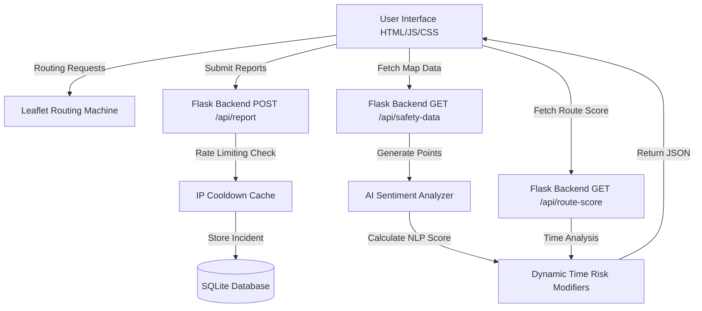

<p align="center">
  
</p>

# SafeOrbit – AI-Powered HeatMap & Routing for Safer Streets

> **Note**: This project is a **Minimum Viable Product (MVP)**. It serves as a proof-of-concept for community safety mapping. The current version utilizes simulated local data and routing heuristics to demonstrate the platform's core capabilities.

## Overview
SafeOrbit is an advanced, AI-powered safety intelligence platform designed to improve security in public spaces. The platform collects real-time user feedback, analyzes risk factors via NLP sentiment analysis, and visualizes this information on a dynamic, color-coded safety heatmap.

By leveraging real-time data, granular time-of-day contextual analysis, and community feedback, SafeOrbit generates responsive safety heatmaps and intelligent routing that help users avoid risky areas and make informed travel decisions.

---

## Architecture Diagram



---

## Key Features

### AI Sentiment Analysis
Safety indicators aren't just random. The backend Python server utilizes Natural Language Processing (NLP) keyword-matching to analyze community reviews (e.g., "dark", "harassment", "safe", "lit"). The sentiment directly influences the safety score and color of an area.

### Advanced Glowing Heatmap Visualization
Locations are displayed using a professional glowing heatmap effect via overlapping, borderless Leaflet circles:
- **Safe**: High community trust, well-lit.
- **Moderately Safe**: Exercise Caution.
- **Unsafe**: High Risk Area based on poor sentiment and time.

### Intelligent Safe Routing & Dynamic Coloring
Input an origin and destination to calculate a route. SafeOrbit provides an **Overall Safety Score** out of 100. The routing line drawn on the map dynamically changes color (Green, Yellow, Red) based on the calculated safety score for the journey.

### Granular Time-Based Safety
Safety risks change drastically when the sun goes down. SafeOrbit features an exact Time Input that dynamically recalculates heatmaps and route safety scores based on the specific hour, heavily penalizing late-night travel in unlit areas.

### Emergency Location Integration
The map automatically generates and plots nearby emergency POIs including Police Stations, Hospitals, and Metro Stops using custom FontAwesome icons to assist users in distress.

### Incident Reporting & Fake Report Prevention
A seamless UI modal allows users to submit General Safety Feedback or report specific incidents. To prevent spam, the backend enforces a strict IP-based 60-second rate limiter (`429 Too Many Requests`). Reports are securely stored in a local SQLite database.

---

## Technology Stack

| Frontend | Backend & AI | Map & Visualization | Database |
|----------|---------|---------------------|----------|
|  HTML5<br> Vanilla CSS<br> JavaScript |  Python<br> Flask |  Leaflet.js<br> Nominatim API |  SQLite |

---

## Getting Started

1. **Clone the repository:**
   ```bash
   git clone https://github.com/yourusername/SafeOrbit.git
   cd SafeOrbit
   ```

2. **Install dependencies:**
   ```bash
   pip install flask
   ```

3. **Run the Flask application:**
   ```bash
   python web.py
   ```

4. **Access the application:**
   Open your browser and navigate to `http://127.0.0.1:5000`
